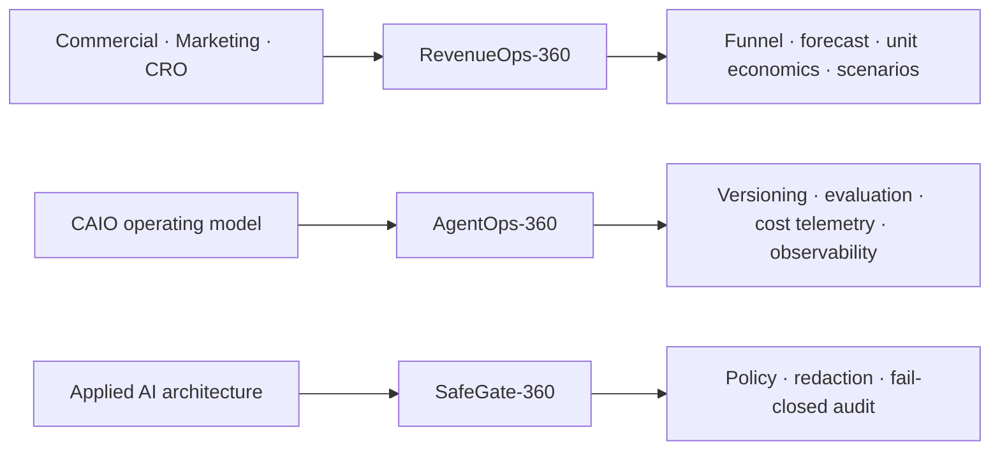

# Didier Lioniello

**Directeur Commercial & Marketing Digital | Chief Revenue Officer (CRO) · Chief AI Officer (CAIO) · Applied AI Architect | Scaling B2B & RevOps**

I connect revenue strategy with applied AI systems that can be evaluated, observed, and governed—not just demonstrated. My public repositories provide reproducible evidence; product code, customer data, prompts, and deployment details stay private by default.

## Selected public work

| Project | What it demonstrates | Verifiable evidence |
| --- | --- | --- |
| [RevenueOps-360](https://github.com/didier-lioniello/RevenueOps-360) · [live dashboard](https://didier-lioniello.github.io/RevenueOps-360/) | B2B funnel economics, forecast discipline, marketing attribution, gross-margin ROI, unit economics, scenario planning, and evidence-linked revenue actions. | [Release](https://github.com/didier-lioniello/RevenueOps-360/releases/tag/v0.1.0) · [CI](https://github.com/didier-lioniello/RevenueOps-360/actions) · [Security](https://github.com/didier-lioniello/RevenueOps-360/security) |
| [AgentOps-360](https://github.com/didier-lioniello/AgentOps-360) | Versioned agent routing, cost estimation and tracking, request-rate guardrails, opt-in evaluation, and privacy-aware observability. | [Release](https://github.com/didier-lioniello/AgentOps-360/releases/tag/v0.1.0) · [CI](https://github.com/didier-lioniello/AgentOps-360/actions) · [Security](https://github.com/didier-lioniello/AgentOps-360/security) |
| [SafeGate-360](https://github.com/didier-lioniello/SafeGate-360) | Fail-closed input/output policy, composable redaction, bounded processing, and metadata-only HMAC audit events. | [Release](https://github.com/didier-lioniello/SafeGate-360/releases/tag/v0.3.0) · [CI](https://github.com/didier-lioniello/SafeGate-360/actions) · [Security](https://github.com/didier-lioniello/SafeGate-360/security) |

These projects are maintained **reference implementations**: small enough to inspect, tested on Python 3.11 and 3.12, scanned with CodeQL and dependency review, versioned as public releases, and explicit about their limits. RevenueOps uses fictional synthetic data; none of the repositories claims client outcomes. They are not descriptions of private products or substitutes for a production security review.

## Evidence standard

- Working code, deterministic fixtures, documented formulas, and reproducible commands.
- CI gates, dependency auditing, protected default branches, security policies, and honest roadmaps.
- No public customer data, private prompts, credentials, product internals, or deployment topology.
- No invented revenue result, production claim, or AI-safety guarantee.

## Engineering principles

- Connect commercial targets to measurable funnel and unit-economics drivers.
- Measure quality, cost, and latency before scaling AI systems.
- Keep model decisions observable and human-controllable.
- Treat prompts, datasets, credentials, and customer context as sensitive assets.
- Prefer reproducible tests and honest limitations over “production-ready” claims.

## Contact

[Portfolio](https://didierlioniello.carrd.co/) · [LinkedIn](https://www.linkedin.com/in/didier-lioniello/)
